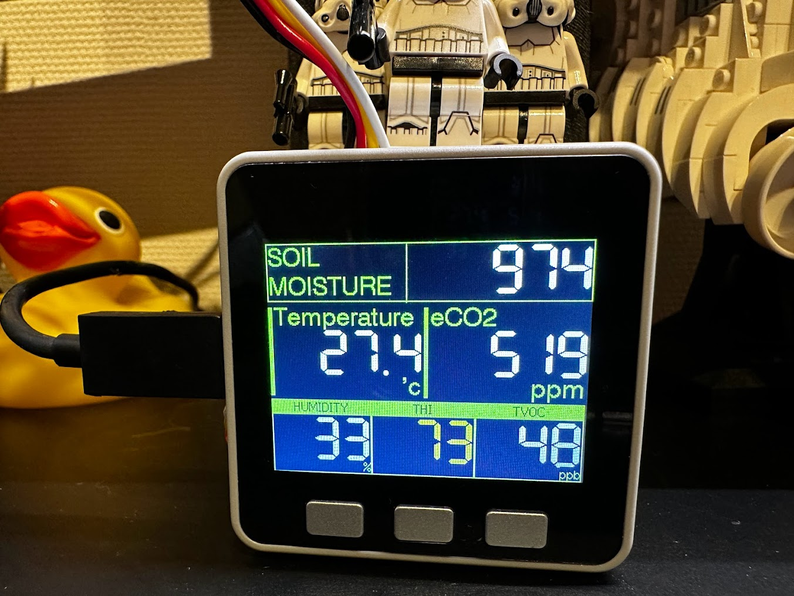

# ewok

Plant monitoring system.

# Device

- [ESP32 GRAY Development Kit with 9-Axis Sensor | m5stack-store](https://shop.m5stack.com/products/grey-development-core?variant=16804796006490)
- [TVOC/eCO2 Gas Sensor Unit (SGP30) | m5stack-store](https://shop.m5stack.com/products/tvoc-eco2-gas-unit-sgp30)
- [ENV III Unit with Temperature Humidity Air Pressure Sensor (SHT30+QMP6988) | m5stack-store](https://shop.m5stack.com/products/env-iii-unit-with-temperature-humidity-air-pressure-sensor-sht30-qmp6988)
- [Earth Moisture Sensor Unit Analog and Digital Output | m5stack-store](https://shop.m5stack.com/products/earth-sensor-unit)

# How to build

1. Install IIJMachinistClient libraly. https://github.com/nara256/IIJMachinistClient
2. copy `config.h.sample` to `config.h`
3. modify `config.h`
